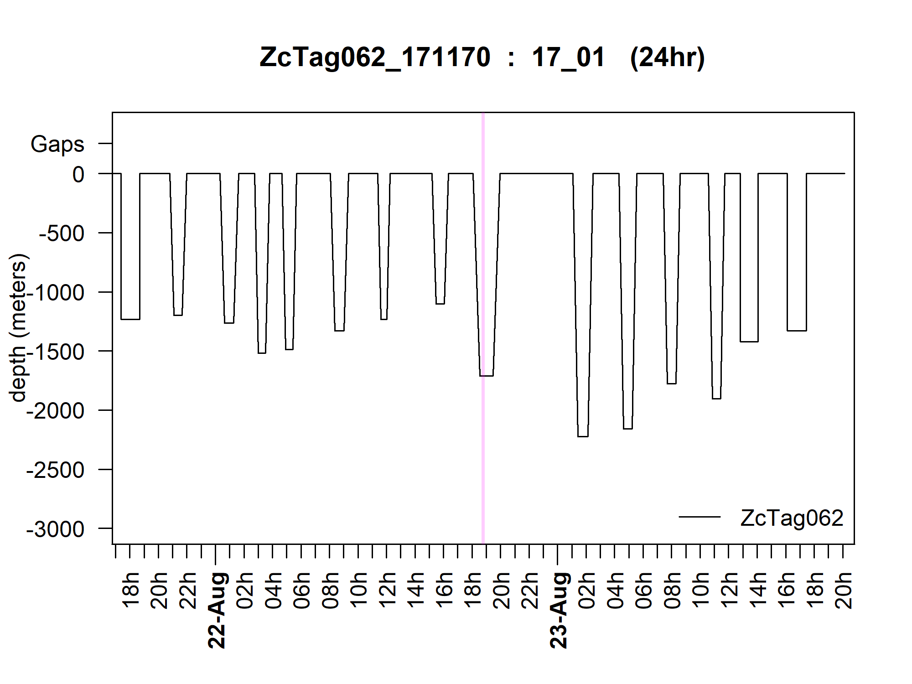
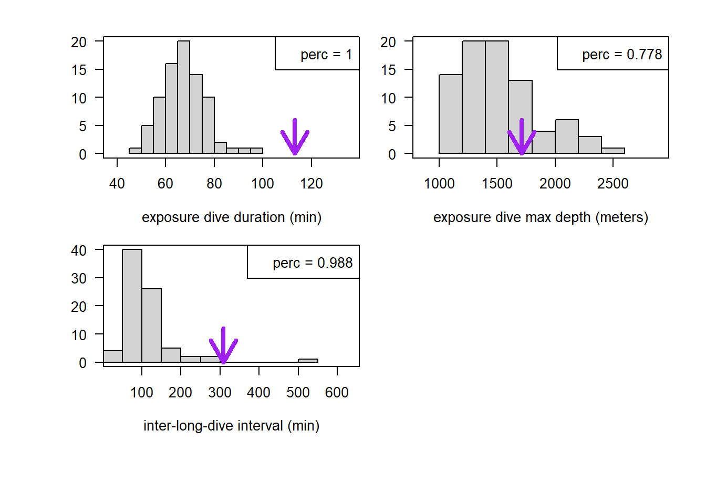

```{r setup, include = FALSE}
# libraries
library(DATAPREPsattagCTMC)

# load the raw and processed data
z62_raw_path <- system.file("sattag_dive/2017_2020_updated/ZcTag062_171170_L2_gonio_pressuresensor_behavior.csv", package="DATAPREPsattagCTMC")
z62_raw <- read.table(z62_raw_path, header = TRUE, sep = ',', stringsAsFactors = FALSE)

z66_pro <- DATAPREPsattagCTMC::prepCTMC(62)

# compare the old and new preps
newprep <- readRDS("00_data/newprep.rds")
oldprep <- readRDS("00_data/oldprep.rds")

# read in the bump results
bumpresults <- readRDS("00_data/test_testbumps_dive_results.rds")
```

# tl;dr

1. fixed the gap problem for behavior data, but it changed the results for 62 dive response even though it had no gaps
2. See below for details, but the dive response for 62 is "unstable" and can be perturbed by very small changes in the input data.
3. Old prep code also filtered on 800 meters (tag is already filtering on 33 minutes). I've removed this for now because I don't think it makes sense, but maybe there is a reason?

# the problem

At some point an error was introduced in to the `DATAPREPsattagCTMC` package which led to gaps being ignored on behavior tags only. We didn't notice since we've been testing with ZcTag062 (henceforth 62) which doesn't have any data gaps.

# background

To understand the details of the bug and the fix a short review of how the behavior data stream is recorded might be useful. 

The so-called behavior data stream is comprised of messages (limited in size argos bandwidth) of alternating 'dive' and 'surface' entries. Candidate dives are identified onboard the tag between dry readings on the conductivity transducer and depths are recorded to +/- 1 m accuracy at 1 hz. If a candidate dive passes pre-determined criteria (over 33 minutes in duration in our case) then it is saved as a dive for transmission as a summary record. The summary includes duration in seconds and maximum depth are recorded to some accuracy. Anything that does not meet these criteria is recorded as a 'surface' and also includes a duration estimate.

Below is the most relevant columns of the beginning of the 62 behavior record.

```{r behavior-data-example, echo = FALSE}
# convert dates into human readable format
z62_raw_posixdates <- z62_raw
z62_raw_posixdates$Start <- as.POSIXct(z62_raw_posixdates$Start, tz = 'utc', origin = '1970-01-01')
z62_raw_posixdates$End <- as.POSIXct(z62_raw_posixdates$End, tz = 'utc', origin = '1970-01-01')

# display a couple of messages
z62_raw_posixdates[1:15, c('Start', 'End', 'What', 'DurationMax', 'DepthMax')]
```

An important detail of the behavior data encoding is that real clock times are only transmitted for the start of a message to save bandwidth and the subsequent times within a message are reconstructed by adding the durations to the initial start time. **Crucically the initial time is only recorded to minute accuracy**, again to save space, although I really wish they would've consulted a biologist before making this compromise. Therefore while each entry within a message is accurate to a few seconds, there can be mini gaps or overlaps between messages up to about a 60 seconds^[I've never been able to figure out if the time is truncated or rounded...].

# the bug

Simply, `DATAPREPsattagCTMC:::prep_behaviour`^[called by `DATAPREPsattagCTMC::prepCTMC`]  discards surface entries and then calculates the difference in real clock time between dives as the surface interval. This is correct within a message, but collapses any gaps between messages into very long surface intervals.

In addition, dives under 800 meters are ignored. I can't remember if we discussed this previously or not, but this is perhaps a strange choice, since the tag programming filters for 33 minutes which is correlated but not exactly the same as 800 meters threshold on depth (which isn't possible to use as a threshold due to programming constraints).

# incidental consequences

Due to the lack of precision in start time of messages, when I corrected the surface interval error (by using the actual reported surface times) some entries were off by several seconds. These should be the more accurate readings, however, due to the clock precision between messages mentioned above. Nevertheless, the differences between the two messages are very small. Here is an example from 62:

```{r differences, echo = FALSE}
surf_diff_sec <- (newprep$dat[[1]]$surface - oldprep$dat[[1]]$surface)*60 # in seconds
hist(surf_diff_sec, las = 1, xlab = "new prep surface - old prep surface (in seconds)", main = "")
```

  As you can see there are only a small number of differences and they tend to be less than 1% of the total value of the surface interval duration.

# consequences in model

For reference here is the exposure plot and distributions of exposure dive and ILDI for 62:





When I reran the model with updated code, I noticed that the dive response result had changed from TRUE to FALSE for 62. The only difference in the input data was as noted above a small number of surface duration changes. The exposure dive is actually the longest duration dive in the entire record and so I'd expect this model to pick it up. On the other hand the surface duration of the exposure while long is not the longest in the record (this result did not change, and was TRUE for inclusion of the effect in both the old prep and the new prep models).

I have a suspicion that since the dive is such a peak, the splines actually have difficulty with it and perhaps this is where the instability is comming from? I reran the model with a variety of tweaks to see if I could change the dive response result.

1. I added pseudorandom numbers from a standard normal to all surface durations (EFFECTIVE)^[a standard normal happens to produce errors of about 1-2% of an average surface duration. So fairly close to what I observed between the old prep and the new prep. This is a more extreme intervention however since I added it to every surface duration not just a small number of them.]
1. I reduced the longest dive duration to the 98 percentile (EFFECTIVE)
1. I reduded `k` in `doCTMC` from 20 to 10. (EFFECTIVE)

In addition, I wanted to see how often small perturbations lead in a change in either surface or dive response. I ran the model 100 times each time adding pseudorandom numbers drawn from a separately seeded standard normal to the surface durations.

```{r surf-purturbations, include = FALSE}
diveres <- sapply(bumpresults, '[[', 1)
surfres <- sapply(bumpresults, '[[', 2)

table(diveres)
table(surfres)
```

In 66/100 models the best model did not include a dive response. in 100/100 models it did include a surface response.

I am performing the same procedure for purturbations to the dive durations, but it isn't complete at time of writing. I can see from my log files that currently 77/77 models include a surface repsonse, and that at least some of the models include a dive response, but not all.

# possible remedies

1. We could use some version of the procedure described above to look for instability in all individuals and then determine some criteria/paradigm for reporting results. This might be slow...
1. My suspicion is the model is having difficulty with very spikey data, perhaps a more adaptive procedure for setting the number of knots could help? Or manual tweaking of knots for each individual?
1. other ideas...?


